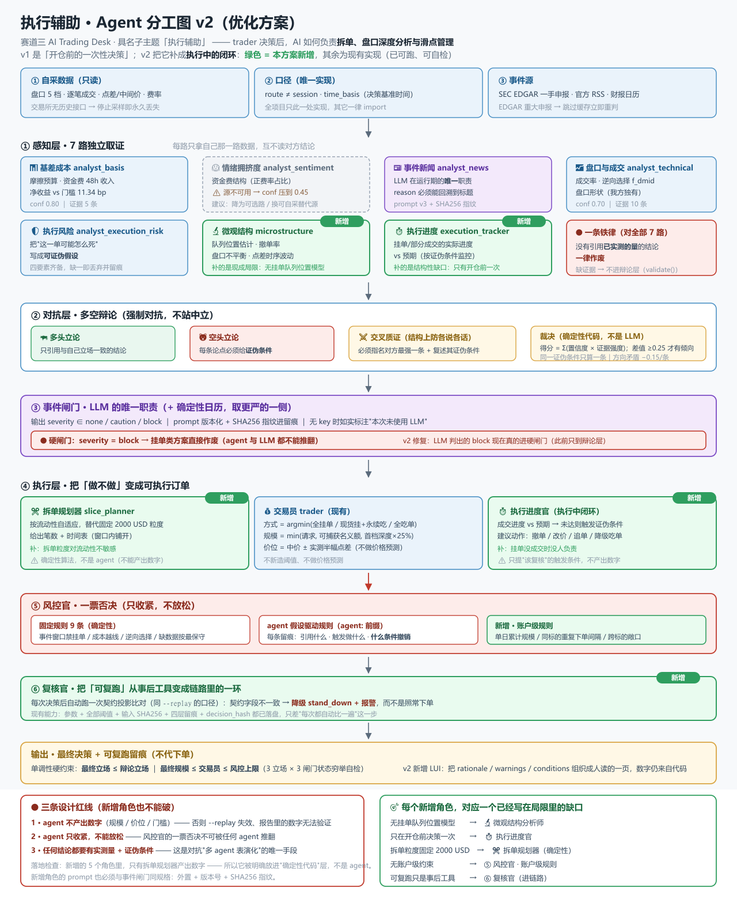

# 项目二 · Execution-aware Alpha

> **给定当前盘口和想要的仓位：这笔单该吃单还是挂单？挂在哪个价？分几笔？**
> **—— 以及这笔单该不该做**（agent 团队给理由与条件，风控官一票否决）。
>
> 状态：**可独立运行** ｜ **零第三方依赖** ｜ 可公网部署 ｜ 快照可核验
> 仓库：<https://github.com/zz-0816/bitget-s2-execution-aware-alpha>（public）
> 加入日期：2026-09-19（由项目一 `tools/isolate_p2.py` 隔离生成，此后**独立演进**）
>
> ⚠️ 参赛作品展示：本项目是**做市型价差捕获**，不是无风险套利；**代币 ≠ 股权**；
> **不代下单**，输出的是理由与条件，**非投资建议**。

---

## 0. 30 秒上手

三种跑法，**都不需要网络、不需要 API key、不需要 pip install**：

```powershell
python run_p2.py --selftest      # ① 全量自检（17 步，含 HTTP 冒烟 + 页面渲染冒烟 + 前端布局验收）
python run_p2.py --demo NVDA     # ② 命令行跑完整决策链（不用浏览器）
python run_p2.py                 # ③ 起网页 http://127.0.0.1:8788
```

要求 **Python ≥ 3.11**（代码用 `datetime.UTC`；实测 3.14.5rc1 / 3.12）。
**零第三方依赖**（纯标准库），所以没有"装不上依赖"这一类失败模式。

想直接给别人一个链接（提交硬门禁「可访问的提交材料」）：

```powershell
python run_p2.py --tunnel        # 起网页 + 临时公网链接（cloudflared，免账号）
```

**评审期推荐用保活启动**（进程崩了自己回来，公网地址固定落盘、随时可查）：

```powershell
# Windows：双击 启动Demo.bat（前台保活）/ 后台运行Demo.bat（关窗口也不停）
# 任意平台：
python tools/keep_alive.py            # 保活：本机服务 + 公网隧道
python tools/keep_alive.py --status   # 看状态（含**当前**公网地址）
python tools/keep_alive.py --stop     # 停止（连子进程树一起收）
```

> ⚠️ 临时隧道的域名**每次重启都会变**，所以"当前链接是什么"要以
> `data/run/public_url.txt`（或 `查看Demo状态.bat`）为准，**不要用旧截图里的地址**。

完整的三条部署路线（临时隧道 / Render / Fly / Docker）与**实测记录**见
**`docs/43-公网可访问.md`**；保活的原理、边界与开机自启见
**`docs/44-长期运行与保活.md`**。

> 不配 LLM key 也能跑：事件判断会退化为确定性日历，并在输出里**如实标注
> 「本次未使用 LLM」**——不假装跑过。

---

## 1. 这是什么（一句话）

> 项目一回答「**哪里有价差**」；项目二回答「**这一单怎么下、能不能下**」。
> 核心不是又一个成本公式，而是**一个会自我质疑的 agent 团队**：
> 5 路独立分析 → 多空辩论 → 事件闸门 → 交易员出方案 → **风控官一票否决**。
> 每一步都必须引用**已实测的量**，每一句结论都必须能被**证伪**，
> 而**数字一律不由 LLM 生成**（否则报告里每个数字都无法复跑）。

⚠️ 注意：本仓库**不是**项目一的一个子目录，而是一个**独立项目**：
自洽的入口、自洽的数据快照、自洽的自检、自洽的页面。
与项目一的关系是**单向只读**（见 §3）。

---

## 2. 项目说明（手册 6 段结构，可直接填表）

> 📌 **填表请直接用 `docs/40-提交材料（填表照抄·项目二）.md`**（按手册 6 段逐段成稿）。
> 下面是同一内容的压缩版，用于在本文件里快速看懂这个项目。

**第 1 段 · 思路**
跨场所价差只在平台「所内撮合」窗口具有零售可执行性，且收益来源是流动性补偿
（做市），不是价差收敛。但**能算出"能不能赚"，算不出"这一单该怎么下"**。
本项目用**一个会自我质疑的 agent 团队**回答执行决策：5 路独立分析 → 多空辩论 →
交易员出方案 → 风控官一票否决。核心假设：执行决策的输入是多维、非结构化、
相互冲突的，因此需要多个独立视角分别取证，再由强制对抗的辩论层收敛；
**但数字不能由 LLM 生成**，否则报告里的每个数字都无法复跑。

**第 2 段 · 目标用户**
主用户＝已经被"执行成本"吃过亏的泛散户/小资金主动交易者（单笔 1k–50k USD，
会在休市时段看行情），痛点是下单后发现点差+滑点+资金费把预期收益吃光，
**不知道该挂还是该吃**。次用户＝已有多平台仓位、会写脚本的小型量化散户。

**第 3 段 · 验证数据与关键指标**
门槛 **11.34 bp** ｜ `P(两腿都成交)=0.70%` vs **`P(只成交一腿)=24.9%`** ｜
旧口径分母错误导致 `META` 高估 12 倍、`GOOGL` 18 倍 ｜ 3/9 个标的最优执行方式改变 ｜
`agent:stale_quotes` **真实驱动了一次一票否决**（`python run_p2.py --demo META`：
现货腿 182~192 分钟无成交 ≥ 30 分钟阈值 → `reject`）｜
自检 **17 步**（离线）全过、退出码 0。全部可复跑，出处逐条写在 `docs/40`。

**第 4 段 · 完成度**
已完成：执行成本模型（三种方式对比 + 实测联合分布）、四层 agent 链、
可复跑日志（`--log` / `--replay`，契约字段逐字节比对）、独立页面与 API、
公网部署配置、prompt 外部化与事件驱动降本、事件判定校准集。
未完成（主动写）：无挂单队列位置模型；事件源非毫秒级；联合分布只有三天；
现货腿自 09-14 起零成交。

**第 5 段 · 材料清单**
见 `SUBMISSION-CHECKLIST.md` 与 `docs/40` 的「材料清单」段。

**第 6 段 · 对 AI Trading 的看法（选填）**
见 `docs/40`。

---

## 3. 独立性、数据快照与可核验性

| 项 | 说明 |
|---|---|
| **对项目一的依赖** | **零**。只读本仓库 `data/` 下的数据快照 |
| **第三方依赖** | **零**（`requirements.txt` 里没有任何包，只有环境要求） |
| `common/` 的 4 个文件 | 隔离时的**冻结副本**；本项目对其做过的本地修改**逐条记录在文件头**（便于审计），要同步上游修复请回项目一改 |
| **数据快照** | 39.9 MB / 19 项，**清单可离线核验** |
| 反向依赖 | 项目一**不依赖**本项目 |

### 跨仓库引用约定（读文档前先看这一条）

`docs/` 里有相当篇幅是**从隔离前的历史继承下来的**，因此会提到一些
**不在本仓库**的路径（项目一的脚本、未截断的历史数据日、旧的架构图）。
这类引用**不是断链** —— 它们都在**项目一仓库**里，只是本仓库只保留了
**快照 + 派生表**。

下表就是**全局声明清单**：写在这里的路径允许在本仓库不存在
（`tools/doc_ref_check.py` 会读这张表 —— 所以每一条都写成**全路径**，
不要写成 `funding_analysis.py` 这种简写，否则登记不上、检查会报出来）。
已就地逐条核对过项目一仓库：

| 类别 | 路径（项目一仓库） | 在本仓库的替代 |
|---|---|---|
| 采集/派生脚本 | `tools/friction_budget.py`、`tools/funding_analysis.py`、`tools/funding_sign_check.py`、`tools/oq8_yahoo_premarket.py`、`tools/precise_fill_analysis.py`、`tools/check_samplers.py`、`tools/precheck_window.py` | **它们产出的派生表**在 `data/derived/`（本仓库只消费，不重跑） |
| 隔离工具 | `tools/isolate_p2.py`、`tools/export_p2_snapshot.py` | 本仓库就是它们的**产物**；已独立演进 |
| 更早的自检入口 | `tools/reproduce_check.py`（项目一"87 项"口径） | `python run_p2.py --selftest`（本仓库口径） |
| 更早的数据日 | `data/spread/2026-09-17.csv`、`data/spread/.trades_state.json` | 快照按"最后 400 轮"截断，更早的日**不在仓库里**；`docs/29` 里的读数是当时记录 |
| 更早的架构图 / 规格 | `docs/multi_agent_architecture.svg`、`project2/README.md` | 现用 `docs/执行辅助-agent分工图-v2.svg`（配 `docs/47`）与 `docs/33` |
| 项目一的清单/数据字典 | `docs/TASKS.md`、`data/manifest.json`、`data/universe.csv`、`data/research/fee_timing_rules.txt` | 本仓库对应 `TASKS-P2.md`、`docs/DATA_DICT.md` |

> ⚠️ 判据是"**本仓库里有没有**"，不是"看起来像不像本仓库的"。
> **检查方式**：`python tools/doc_ref_check.py`，判定**以 git 入库状态为准**：
> 已入库 / 被 `.gitignore` 排除的运行时产物 / 已声明的跨仓库引用 / **未声明失效**
> 四类分开判，最后一类**退出码 1**。能读到项目一仓库时还会**就地核对上游真有那个文件**
> （声明了但上游也没有 = 真断链，照样失败）；读不到时如实标注"未验证上游"，
> 不假装验证过。
>
> 🔴 顺带一条值得记的教训：这个检查器**初版按 `os.path.exists()` 判**，
> 于是 `data/derived/event_driven_state.json` 这种被 gitignore 的运行时产物
> 在开发机上通过、在**刚 clone 出来的仓库里失败** —— 检查器自己不可移植。
> 改成以 git 为准后才成立。**"换个机器结论就变"是这个仓库最不能接受的一类缺陷。**

### 数据快照的三类文件（这一条是被坑过才写下来的）

`data/SNAPSHOT.md` 由 `tools/snapshot_manifest.py` 生成，把文件分成三类**分开列、分开验**：

| 类别 | 例子 | 核验方式 |
|---|---|---|
| ① 冻结快照 | `data/spread/orderbook-*.csv`（前 400 轮） | **SHA256 必须逐字节一致**，不一致即退出码 1 |
| ② 本仓库派生物 | `data/derived/rag_index.json` | 哈希与上游那张表**本就不该一致**，核验方式是「能重建」 |
| ③ 运行期可变 | `news_state.json` 等 | 只查存在与非空，哈希仅作参考 |

> 为什么必须分开：混在一张表里用同一个哈希去验，结果只有两种 ——
> **误报**（把正常运行当成数据被篡改），或者**干脆没人验**。两种都是"清单撒谎"。

```powershell
python tools/snapshot_manifest.py --verify     # 就地核验，冻结项不一致 -> 退出码 1
```

⚠️ 快照是**截断**的（盘口保留**最后** 400 轮、trades 保留尾部 8 万行）——
`data/SNAPSHOT.md` 逐文件写明处理方式、行数与 SHA256。**这是如实标注，不是借口。**

> 📌 盘口为什么是**最后** 400 轮而不是前 400 轮：上游导出脚本对盘口取的是**前** N 轮，
> 对 trades 取的是**尾部** N 行 —— 拼在一起会自相矛盾（盘口停在 09-18 19:19，
> 成交却到了 09-19 07:16，**差 12 小时**）。对一个卖点是"同一时刻的盘口 + 逐笔成交"
> 的决策演示，这是硬伤（腿风险/成交率/深度会来自两个不同时段的市场）。
> 所以本仓库把盘口改成**保留最后 400 轮**与之对齐；重截断工具是
> `tools/retruncate_orderbook.py`（自带自检，且**不会改动源文件**）。

---

## 4. 一键自检（18 步离线 + 2 步联网）

```powershell
python run_p2.py --selftest        # 离线 18 步
python run_p2.py --selftest --net  # 额外跑 ⑳ 消息面源、㉑ 事件判定回归门槛
```

| # | 检查 | 防的是什么 |
|---|---|---|
| ① | 执行成本模型 | 数字算错 |
| ② | 事件闸门（含失败语义 / 日历质量） | 闸门悄悄失效 |
| ③ | 多 Agent 团队（分析师→辩论→交易员/风控官→**执行进度官**→复现日志） | 一票否决被绕过、复跑对不上 |
| ④ | RAG 记忆（能消化 / 不膨胀 / **只读** / **校准集留出**） | 上下文膨胀、抄答案 |
| ⑤ | 数据快照核验（冻结项逐字节） | 数据被改动而不自知 |
| ⑥ | 持仓期巡检 | 裸露敞口无人报警 |
| ⑦ | 可计算事件（期权到期/休市） | 日历口径漂移 |
| ⑧ | 配置解析（.env 优先级） | key 泄露 / 配置没生效 |
| ⑨ | 事件判定校准集（schema + 覆盖 + 留出规则） | 拿答案喂模型还自称校准过 |
| ⑩ | 盘口重截断（保留最后 N 轮） | 盘口与成交来自**两个不同时段** |
| ⑪ | 保活守护（地址解析 / 退避 / 状态落盘 / 隧道默认值） | 链接悄悄死掉、地址抓错 |
| ⑫ | **HTTP 冒烟** | 页面调用的端点**根本不存在** |
| ⑬ | **页面渲染冒烟**（Node 最小 DOM 里真跑一遍 `web/app.js`） | 页面**整页空白**而自检全绿 |
| ⑭ | **前端设计检查**（类名一致 / 对比度 / reduced-motion / focus-visible） | 状态类没定义、深色主题看不清、动效不尊重系统设置 |
| ⑮ | **前端布局验收**（真浏览器：溢出 / 字面标记 / 截断 / 卡住的占位符） | 只有真渲染 + 量尺寸才发现的排版故障 |
| ⑯ | **长跑记录器**（汇总统计算法 / 记录格式 / 空与坏数据） | 稳定性与效率的**证据源**自己算错 |
| ⑰ | **文档路径引用**（以 git 入库状态为准 / 已声明的跨仓库引用 / 未声明失效） | 文档里的路径**点不回去**（继承自隔离前的引用最易腐坏；"磁盘上有但没入库"也算坏） |
| ⑱ | 📡 **行情通道 + ⚓ 外部锚**（schema 归一 / 落盘守卫 / **口径守卫**） | 采样器**写坏冻结快照**；归一化列与快照不一致；把"休市偏移"当成"折溢价"报出去 |
| ⑳ | 消息面源可用性（`--net`） | 事件源悄悄失效 |
| ㉑ | **事件判定回归门槛**（`--net`，留出集 n=10） | **把已经修掉的危险方向错误改回去** |

> 第 ⑮ 步需要真启动浏览器。**没装浏览器**、或**装了但起不来**
> （受限策略 / 无桌面会话 / profile 被锁）时它会 `[skip]` 并返回 0 ——
> **本机实测**：用 **Edge** 时它真的跑起来了并通过（`[skip]` 从 2 项降到 0 项）。
> **不因为环境缺浏览器就让整套自检变红**；而"页面真的检查不过"仍然会红
> （退出码 1 vs 环境问题的 3，见 `docs/46` §6）。
>
> 第 ㉑ 步**没有 LLM key 时如实报"未执行"并返回 0**：既不冒充通过，也不算失败。
> 它有硬门槛：危险方向错误必须为 **0**、一致率不得低于 **90%**、且不得比基线退化。

### 前端设计（可验证，不靠"看着还行"）

页面的配色与动效**不是随手挑的**，而是按两套公开设计系统手写的，
并且**每次自检都会重算**：

| 项 | 依据 / 检查方式 |
|---|---|
| 色阶 | [Radix Colors](https://github.com/radix-ui/colors) 的 **12 级深色语义**（1 背景 … 12 高对比文字） |
| 间距 / 圆角 / 缓动 | [Open Props](https://github.com/argyleink/open-props) 的 4px 刻度与 `ease-*` |
| 时长档位 | [Material 3 motion](https://m3.material.io/styles/motion/easing-and-duration/tokens-specs)（短 100–200ms / 中 250–400ms） |
| **对比度** | `tools/ui_design_check.py` 按 CSS 变量**实算 WCAG**，12 组全部 ≥4.5（最低 5.74） |
| **类名一致性** | 同一工具双向比对 JS/HTML 用到的类 vs CSS 定义的类（改样式时最容易悄悄坏的就在这） |
| **无障碍** | `prefers-reduced-motion` 兜底 + `:focus-visible` 焦点环 + 跳转链接 + `aria-live` |
| 依赖性 | **零第三方依赖**：没有 CDN、没有框架、不下载字体，离线照常工作 |

> ⑫⑬ 是**被真实故障逼出来的**：本仓库最初把项目一的 `web/` 一起复制了过来，
> 而它调用的 `/api/overview`、`/api/timeline` 只有项目一的服务才有 ——
> 独立跑起来**整页是空的**，当时所有自检却都是绿的（没有一个自检去碰页面）。
> 现在：端点集合集中写在前端 `API` 对象里，自检照着它真的打一遍；
> 再用 Node 在最小 DOM 里渲染一遍，逐区块检查有没有真的出内容。

**信息架构与页面结构**（v3 起：6 段步进器 + 按需展开的详情）见
`docs/49-前端信息架构与UI设计规范（v3）.md`，截图存证在 `docs/ui-v3/`。
回滚不需要仓库里另存备份 —— 上一版 UI 就在 git 历史里（`docs/49` §9 给了三条命令）。

---

## 5. 目录

```
├── run_p2.py            唯一入口：网页 / 自检 / 命令行演示 / 公网隧道
├── README.md            本文件
├── SUBMISSION-CHECKLIST.md  提交前逐条打勾（硬门禁 / 评分项 / 归档）
├── TASKS-P2.md          任务清单与完成状态
├── requirements.txt     零第三方依赖（只写环境要求）
├── Dockerfile           python:3.12-slim + tzdata（slim 镜像缺 tz 数据会崩）
├── render.yaml          Render 一键部署（Blueprint）
├── fly.toml             Fly.io 一键部署
├── 启动Demo.bat          Windows 双击：**保活**启动（进程掉了自动拉起 + 公网地址落盘）
├── 后台运行Demo.bat      Windows 双击：后台保活（关掉窗口也不停）
├── 查看Demo状态.bat      Windows 双击：看状态 + **当前公网地址** + 最近日志
├── 停止Demo.bat          Windows 双击：停止（连子进程树一起收，不留孤儿隧道）
├── start_demo.sh        Linux/macOS/WSL：一键起服务 + 公网链接
├── .env.example         LLM 配置模板（任意 OpenAI 兼容端点；不配也能跑）
├── prompts/             🔸事件判断 prompt（版本化，可回溯到具体版本 + SHA256）
├── common/              冻结副本：config / console / market_calendar / rag_memory
│                        （本地修改逐条记录在文件头）
├── project2/            核心：execution_cost · agent_team · event_gate · market_events
│                        · mcp_client · signal_adapter · events_calendar.json
├── tools/               消息面 / 情绪采样 / 持仓巡检 / 联合分布 / 阈值敏感性 /
│                        模型对比 / 快照清单 / 盘口重截断 / 页面冒烟 / 事件判定校准 /
│                        长跑记录器（run_record.py，稳定性与效率的实测证据源）
├── web/                 独立页面（决策链 / 概览 / 阈值透明化 / 快照 / 告警弹窗）
├── data/                数据快照（SNAPSHOT.md 可核验）+ 决策日志 + 校准集
└── docs/                口径、叙事与提交材料（见下）
```

**关键文档**

| 文档 | 用途 |
|---|---|
| `docs/40-提交材料（填表照抄·项目二）.md` | **填表直接粘贴**（手册 6 段 + 大模型作用 + 两套赛道措辞） |
| `docs/41-赛道选择与两投接口.md` | 赛道三 vs 赛道一开放主题的对比与推荐；与项目一的七个交接点 |
| `docs/34-项目二叙事重写（agent团队主线）.md` | 叙事主线（最完整） |
| `docs/33-Agent团队分工图与规格.md` | agent 团队逐 agent 规格与三条设计红线 |
| `docs/14-往返摩擦预算与精确化成交判定.md` | 成本门槛与联合成交分布的口径 |
| `docs/42-prompt版本化与事件驱动降本.md` | prompt 版本化 + 事件驱动的完整规则与**代价** |
| `docs/43-公网可访问.md` | 三条部署路线 + 实测记录 + 常见故障 |
| `docs/44-长期运行与保活.md` | 保活的原理、边界与开机自启 |
| `docs/46-事件闸门接线与复跑契约.md` | 硬闸门如何合并 LLM 判定；复跑契约的两处坑 |
| `docs/47-执行辅助agent分工优化（v2）.md` | **执行辅助的 agent 分工优化方案**（配图：`docs/执行辅助-agent分工图-v2.svg` / `.png`） |
| `docs/48-执行进度官·校准回归门槛·长跑归因（本轮三项）.md` | 本轮三项：校准**危险方向**修正 + 回归门槛、事件驱动降本实测、**执行进度官**（含抓到的时钟不一致 bug） |
| `docs/49-前端信息架构与UI设计规范（v3）.md` | 页面信息架构（6 段步进器）、设计 token 规范、可用性取舍与回滚方式（截图：`docs/ui-v3/`） |
| `docs/50-后续新增标的操作清单.md` | 以后要**加标的**时逐层要改什么、不改会怎么静默出错（含两处必踩的坑） |
| `docs/53-接入官方MCP（数据源集成）.md` | 接官方 `bitget-mcp-server`：把**财报日历 / 除息**做成硬闸门的**第三个源**（实测接入当天抓到 META 除息日=当天）；含两个接入坑与"没有接什么、为什么" |
| `docs/52-完整执行辅助团队：编制、接口与落地顺序.md` | 要当成**真实可用的完整交易系统**还缺谁：采集官 / 仓位官 / 对账官 / 复核官 / 日报官；交易所只读接入的红线与签名；**现在能做 vs 需要你提供 key** |
| `docs/51-怎么用（小白版）与离场问题的边界.md` | **三步上手** · 什么时候能交易（看哪一格）· **什么时候离场：本项目为什么不给**（配图 `docs/使用流程图.png` / `.svg`） |
| `docs/29-现货腿零成交事件（0914起）.md` | 最重要的那条局限的完整记录 |

### Agent 分工图



> 上：**v2 优化方案** —— 在 v1「开仓前一次性决策」之上补出**执行中的闭环**
> （绿色为本方案新增：微观结构分析师 / 执行进度官 / 拆单规划器 / 账户级规则 / 复核官）。
> v1 的分工与逐 agent 规格见 `docs/33`，优化理由与落地顺序见 `docs/47`。
> 矢量版（可放大、可编辑）在 `docs/执行辅助-agent分工图-v2.svg`。

---

## 6. 页面与接口

页面刻意**只调用本仓库自己的端点**（历史故障见 §4 的说明）：

| 端点 | 用途 |
|---|---|
| `/api/health` | 存活 + 快照时间点 + LLM 是否配置 |
| `/api/decision?base=NVDA&qty=5000` | **完整决策链**（5 路分析→辩论→闸门→交易员→风控官→最终 + `decision_hash`） |
| `/api/decision?base=NVDA&position=demo` | 同上，并带上**在途持仓单** -> 第 6 路**执行进度官**（`auto` 读 `data/positions/open.json`／`demo` 用**带 `synthetic` 标记**的合成单／`none` 关掉） |
| `/api/assess?base=NVDA` | 风险与理由（不代下单，只给理由与条件） |
| `/api/overview` | 全标的汇总 |
| `/api/params` | **生效阈值与来源**（页面上每个数字都能点回代码常量） |
| `/api/snapshot` | 数据边界（`data/SNAPSHOT.md` 原文） |
| `/api/alerts` | 持仓期巡检告警（右下角闪烁弹窗的数据源） |

页面上的东西刻意做成**可自证**的：最终裁决旁边就是 `decision_hash`、
输入文件的 `SHA256(16)` 与复跑命令；风控官区块把**未触发的规则也列出来**并写明
「什么条件下撤销」；阈值表把每个常量的**代码位置**摊开。

---

## 7. 已知局限（主动写，这是可信度来源）

① **现货腿自 09-14 起零成交**（报价仍在）→ 现货挂单路径当前不可执行；
② 联合分布只覆盖 09-12~09-14；③ 容量是制度性（SEC 豁免限符号与成交量）+ 流动性双重限制；
④ 无挂单队列位置模型；⑤ 事件源非毫秒级；
⑥ 无 key 时事件判断退化（会**如实标注**，不假装）；
⑦ 采样缺口 8.04 h + 74.9 min（均 100% 落在 `stockroute`）；
⑧ 事件判定校准集 **n=10**，只能做回归与危险方向检查，**不能当准确率结论**；
⑨ **执行进度官**的输入依赖人工维护的持仓单 —— 没有真实下单记录时只能用 `demo` 合成单演示
（判据可验证，但**缺少真实输入**）；
⑩ 长跑记录里 412 轮是**旧代码**跑的（记录已加 `src_sha16` 代码指纹按版本分组，
带指纹的轮次从 2026-09-20 起重新累积）—— 旧轮次**不能**给当前代码背书。

完整清单与出处见 `docs/40` 与 `docs/34` 第 6 段。

> ⚠️ 材料里**不要写**的三条：① "rToken 跟踪偏离 −33~+85 bp"（**已撤回**，实测中位 +1.7 bp）；
> ② "用周末样本跑了 60 天回测"；③ "SEC 批准了我们的策略"。

---

## 8. 合规与术语

| 必须用 | 禁止用 |
|---|---|
| **做市型价差捕获** | 无风险套利 / risk-free arbitrage |
| 代币化美股 / rToken（**并写明"代币 ≠ 股权"**） | "股票" |
| 期望收益 / 实测区间 | 年化收益 / 稳赚 / 保证 |

**每段都要能点回一个可复跑的证据；点不回去的数字，删掉。**
